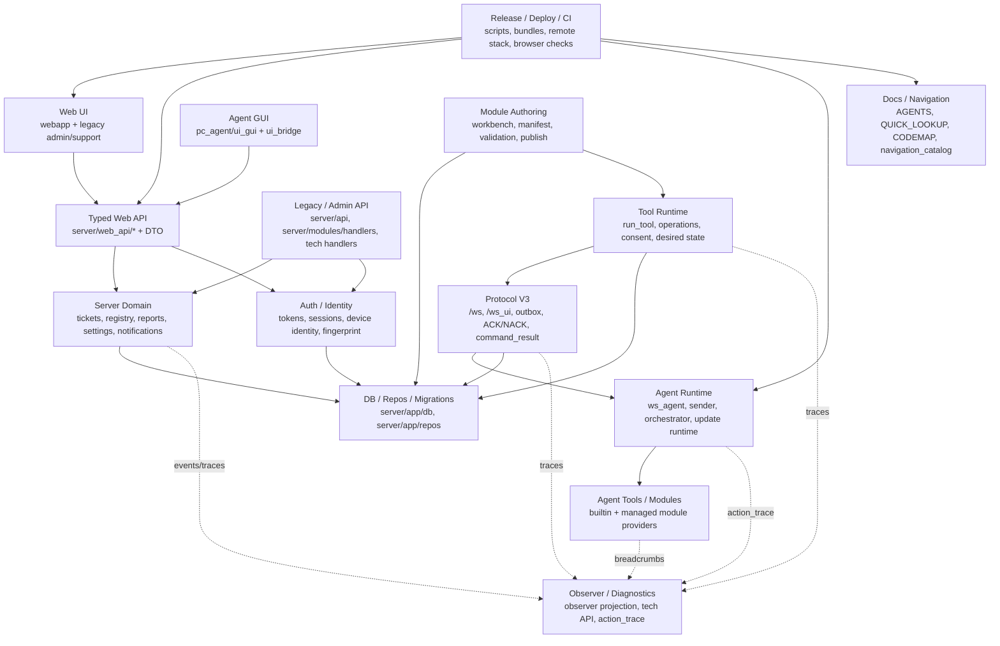

# Architecture Boundaries

Этот документ фиксирует границы владения в `pc_client`: где изменение считается локальным, где оно задевает контракт, и какие соседние зоны нужно проверить перед commit, push или deploy.

Он не заменяет `server/docs/CODEMAP.md` и `pc_agent/docs/CODEMAP.md`. CODEMAP отвечает на вопрос "где лежит код". Этот документ отвечает на вопрос "кого может задеть правка".

## Обязательное правило перед правками

Перед изменением кода агент должен:

1. Открыть `docs/CODEX_WORKFLOW.md`, `docs/QUICK_LOOKUP.md`, `docs/CONTEXT_INDEX.md` и соответствующий CODEMAP.
2. Выбрать рабочий режим Codex: Explore, Debug, Plan, Execute, Feature, Contract, Verify, Commit или Deploy.
3. Выполнить точечный `python scripts/search_context_index.py "<символ route error-code concept>"`, чтобы быстро найти связанные docs/routes/symbols.
4. Найти затронутую ownership zone в этом документе.
5. Проверить, не меняется ли contract surface из раздела ниже.
6. Если меняется contract surface, считать задачу cross-cutting: обновить связанные docs/CODEMAP, расширить тесты и не вести параллельно независимую на вид задачу в соседней зоне без явной проверки.

Короткое решение:

- Меняется только реализация внутри одной зоны без публичного формата, маршрута, схемы БД, protocol frame, manifest или DTO: local change.
- Меняется вход/выход зоны: boundary change.
- Меняется общий контракт, которым пользуются server, agent, webapp, runtime или deploy: cross-cutting change.
- Меняется deploy, build, release, migration или live runtime lifecycle: release/control change.

## System Map

## Ownership Zones

| Zone | Primary files | Owns | Public boundary | Typical checks |
|---|---|---|---|---|
| Project workflow and navigation | `AGENTS.md`, `docs/CODEX_WORKFLOW.md`, `docs/QUICK_LOOKUP.md`, `docs/CONTEXT_INDEX.md`, `docs/README.md`, `scripts/navigation_catalog.py`, `scripts/task_intake.py`, `scripts/context_index.py`, `scripts/search_context_index.py`, `server/docs/CODEMAP.md`, `pc_agent/docs/CODEMAP.md` | How agents find context, required docs, drift rules, recommended checks and retrieval | Human and machine workflow contract | `python scripts/task_intake.py --task "<task>"`, `python scripts/search_context_index.py "<query>"`, `python scripts/docs_inventory.py --check-links`, `python scripts/verify_workspace.py` |
| Server startup and routes | `server/server.py`, `server/routes.py`, `server/config.py`, `server/static_pages/*` | aiohttp app, route registration, startup/shutdown, static SPA/legacy shells | HTTP/WS route table, feature flags, runtime startup behavior | `python scripts/verify_workspace.py`, route/API tests, browser check for UI routes |
| Typed web boundary | `server/web_api/*`, `server/web_api/dto/*`, `webapp/src/features/*/api.ts`, `webapp/src/shared/realtime/*` | Stable payloads for React workspaces and web session/realtime bootstrap | `/api/web/*` DTO shape, httpOnly session behavior, `/ws_ui` bootstrap contract | server web API tests, webapp type/build checks, remote browser signoff for visible changes |
| Legacy web UI | `server/admin.*`, `server/support.*`, `server/ticket.*`, `server/help.*`, `server/web_shared.js` | Legacy admin/support/ticket/requester shells | Legacy endpoints, DOM contracts used by browser checks, shared JS helpers | browser check at `https://192.168.100.17:9443/admin`, relevant server tests |
| React webapp UI | `webapp/src/app/*`, `webapp/src/pages/*`, `webapp/src/features/*`, `webapp/src/components/*`, `webapp/package.json`, `webapp/playwright.config.ts` | New SaaS-style admin/support/reports/settings/knowledge UI | Typed `/api/web/*`, route model `/app/*`, built asset pipeline | `python scripts/bootstrap_web_toolchain.py`, pnpm checks, browser signoff |
| Auth, sessions and device identity | `server/auth/*`, `server/websocket/agent_handshake.py`, `pc_agent/auth/*`, `pc_agent/core/identity.py`, `pc_agent/core/machine_identity.py`, `pc_agent/core/device_fingerprint.py` | Agent tokens, web sessions, AuthContext, connection requests, machine/install identity | Token semantics, session cookies, `device_id` source of truth, fingerprint tolerance | auth tests, handshake tests, no raw token logging review |
| Server domain: tickets/chat/forms/routing | `server/tickets/*`, `server/chat/*`, `server/web_api/support_handlers.py`, `server/web_api/settings_handlers.py`, `server/web_api/policy_health_handlers.py`, `server/tickets/form_catalog.py`, `server/tickets/routing_service.py`, `server/tickets/policy_health_service.py` | Ticket lifecycle, queue/routing/SLA/OLA, forms, chat messages, support payloads, Policy Health checks/simulation | Ticket event shapes, canonical status contract, status transitions, public queue projection, form payload keys, routing rule semantics, policy-health schema | ticket/support/settings/policy-health tests, observer summary checks if trace-visible, browser check for UI/static changes |
| Service Catalog process layer | `server/tickets/service_catalog_*`, `server/app/repos/service_catalog_repo.py`, `server/web_api/service_catalog_handlers.py`, `scripts/seed_service_catalog.py`, `webapp/src/features/service-catalog/*`, `webapp/src/pages/help/index.tsx`, `pc_agent/ui_gui/chat_panel.py`, `pc_agent/ui_gui/server_api.py` | Requester-facing services and offerings, fallback `other.unknown`, publication gates, requester-safe preview, catalog-aware create/preview, service/offering policy inheritance and reporting dimensions | `/api/web/admin/service-catalog*`, `/api/service-catalog/current`, `POST /api/service-catalog/preview`, create payload fields `service_code`/`offering_code`, `custom_fields.service_catalog`, ticket reporting columns | service catalog tests, ticket create regression tests, webapp build, agent GUI helper/API tests, browser signoff for `/app/admin/service-catalog` and requester help flow |
| Knowledge Platform | `server/knowledge/*`, `server/app/repos/knowledge_repo.py`, `server/web_api/knowledge_handlers.py`, `server/app/db/migrations/versions/*knowledge*`, `server/docs/KNOWLEDGE_PLATFORM.md`, `server/docs/KNOWLEDGE_OPERATIONS.md`, `scripts/seed_knowledge_content.py`, `content_packs/knowledge/*`, `webapp/src/features/knowledge/*`, `webapp/src/pages/help/index.tsx`, `webapp/src/pages/knowledge/index.tsx`, `webapp/src/pages/admin/knowledge-page.tsx`, `pc_agent/ui_gui/server_api.py`, `pc_agent/ui_gui/chat_panel.py` | Universal knowledge spaces/items/versions/chunks, search/suggestions, ACL visibility, service/offering bindings, graph, ingestion, feedback/deflection metrics, passport-to-draft, content packs, templates/lint, review tasks, quality/gap operations, search analytics, rollout policies and support knowledge panel integration | `/api/knowledge/search|suggest|feedback`, `/api/web/knowledge/*`, selected-version publish, content-pack apply/retire, review-task/quality/gap/search-analytics/rollout APIs, `knowledge_attempts` create payload extension, `ticket_knowledge_links`, existing `/api/tickets/{id}/kb_links` compatibility | knowledge contract/repo/visibility/search/suggestion/feedback/graph/ingestion/passport/API/metrics/publish/DB-constraint/content-pack/templates/lint/review/quality/gap/search-analytics/operations tests, P0/P1 regressions, webapp build, agent tests, browser signoff for `/app/admin/knowledge`, `/app/knowledge`, `/app/help`, `/app/tickets/:ticketId` |
| Registry / inventory / CMDB | `server/registry/*`, `server/app/repos/registry_repo.py`, `server/web_api/registry_handlers.py`, `server/web_api/admin_handlers.py`, `pc_agent/ui_gui/chat_panel.py`, `pc_agent/ui_gui/server_api.py` | People/departments/locations/assets/vendors/services, device inventory and profile sync | Registry API payloads, auto-linking semantics, inventory cleanup behavior | registry/admin web API tests, inventory browser check |
| Module authoring and publication | `server/modules/*`, `server/utils/module_builder.py`, `server/utils/module_manifest.py`, `server/utils/module_preflight.py`, `server/utils/module_observer_contract.py`, `server/admin_modules_workbench.*`, `webapp/src/features/modules/*` | Workbench, ZIP upload/create, manifest normalization, preflight, preferred version assignment | Module manifest schema, owner/conflict rules, workbench API, preferred-version source of truth | module manifest/preflight/workbench tests, `python scripts/verify_workspace.py` |
| Diagnostic capability projection | `server/diagnostics/*`, `server/app/repos/diagnostic_provider_config_repo.py`, `server/utils/module_manifest.py`, `server/tools/service.py`, `pc_agent/core/registry.py`, `pc_agent/modules/impl/*` | Universal capability descriptors, execution target metadata, readiness, execution routing, evidence preview, server-side provider routes, provider config lifecycle | `/api/diagnostics/capabilities`, `/api/tickets/{ticket_id}/diagnostics/capabilities`, `/api/tickets/{ticket_id}/diagnostics/capabilities/{capability_id}/run`, `/api/diagnostics/providers/configs*`, `/api/web/admin/diagnostics/providers/configs*`, readiness `reason_code` / `actions`, execution envelope fields, `server_capability` operation records, Zabbix server-connector JSON-RPC results, manifest `execution`/`deployment`/`safety`/`readiness`/`evidence`/`artifacts` blocks | capability no-db tests, provider config DB tests, Zabbix provider fake-HTTP tests, server-builtin operation lifecycle tests, manifest tests, agent registry tests, support DTO tests when UI consumes fields |
| Diagnostic ticket layer | `server/diagnostics/service.py`, `server/diagnostics/projection.py`, `server/diagnostics/sessions.py`, `server/diagnostics/findings.py`, `server/diagnostics/bundle.py`, `server/app/repos/diagnostics_repo.py`, `webapp/src/features/diagnostics/*`, `webapp/src/pages/tickets/*` | Ticket-scoped diagnostic sessions, steps, normalized evidence, findings, bundles and support workspace projection | Diagnostics must not mutate `tickets.status`; operation/playbook/observer/remote assist lifecycle remains owned by existing subsystems; passport bridge starts from `selected_for_passport` | `server/tests/test_diagnostic_layer.py`, observer/playbook/remote/passport regression tests, frontend type/build checks |
| Tool execution and operations | `server/tools/*`, `server/app/services/operation_service.py`, `server/api/operations.py`, `server/websocket/protocol.py`, `server/app/repos/device_outbox_repo.py` | `run_tool`, operation lifecycle, consent, async enqueue, desired state before run | `tool_call_started` invariant, `operation_id`, command payload, async/sync response contract | operation/tool/outbox tests, protocol async enqueue/waiter tests |
| Server websocket and outbox transport | `server/websocket/*`, `server/state_manager.py`, `server/app/repos/device_outbox_repo.py`, `server/tests/test_agent_services_pipeline.py` | `/ws`, `/ws_ui`, Protocol V3 services, ACK/NACK, command_result, retry/delivery state | Protocol V3 wire format, capabilities, outbox idempotency, device binding | protocol/server websocket tests, agent websocket tests when wire shape changes |
| Agent runtime core | `pc_agent/ws_agent.py`, `pc_agent/ws_agent_runtime_helpers.py`, `pc_agent/core/sender.py`, `pc_agent/core/database.py`, `pc_agent/core/orchestrator.py`, `pc_agent/core/consent_service.py` | WS connection, sender/outbox, command handling, local SQLite, cancellation, consent, update scheduling | Agent command contract, local DB schema, outbox ACK deletion semantics, update command result semantics | `python -m pytest pc_agent/tests -m "not manual"`, selected server protocol tests |
| Agent modules and tool registry | `pc_agent/core/module_manager.py`, `pc_agent/core/loader.py`, `pc_agent/core/registry.py`, `pc_agent/core/tools.py`, `pc_agent/modules/base_module.py`, `pc_agent/modules/impl/*`, `pc_agent/modules_packages/*`, `shared/tool_contracts.py` | Builtin/managed tools, semantic ids, aliases, params/output schema, risk metadata, module loading | Tool contract vocabulary, `ToolResponse`, `data.result`, observer breadcrumb requirement | module registry tests, support module package tests, `python scripts/verify_workspace.py` |
| Observer and diagnostics | `server/observer/*`, `server/tech/*`, `server/web_api/admin_handlers.py`, `server/web_api/dto/admin.py`, `pc_agent/core/action_trace.py`, `pc_agent/core/orchestrator.py`, `pc_agent/modules/base_module.py` | Trace projection, dangerous-flow visibility, tech diagnostics, agent action trace bridge | Observer trace/span schema, `root_kind`, `trace_id`, mandatory `tool.entry`, diagnostic bundle shape | observer tests, module observer contract tests, live observer canary for risky flows |
| Agent update / launcher / rollout | `server/agents/*`, `server/app/repos/agent_rollout_repo.py`, `pc_agent/launcher/*`, `pc_agent/launcher_portable_main.py`, `pc_agent/build_windows_release_v2.py`, `pc_agent/ws_agent.py`, `pc_agent/ui_bridge/api_server.py`, `pc_agent/ui_gui/main_window.py` | Build upload, rollout policy, recommendation, pending update, launcher apply/rollback, GUI update CTA | Agent update API, handshake update report fields, single-flight pending update state | agent update docs/tests, launcher canary flow, release artifact verification |
| Local GUI and UI bridge | `pc_agent/ui_bridge/*`, `pc_agent/ui_gui/*`, `pc_agent/ui_gui/server_api.py` | Local Qt UI, SSE/API bridge, runtime status/logs/shutdown/update, chat panel | `/ui/agent/*` local API, GUI auth/update states, server API client behavior | UI bridge tests, local agent GUI smoke when visible behavior changes |
| Database, repos and migrations | `server/app/db/models.py`, `server/app/db/migrations/versions/*`, `server/app/repos/*`, `pc_agent/core/database.py` | PostgreSQL schema, repos, migration lifecycle, test DB behavior, agent SQLite schema | Table/column semantics, migration order, repo transaction behavior, local DB schema version | migration-aware tests, DB-backed server pytest, pc_agent DB tests |
| Release, deploy and remote control | `scripts/release_server_to_remote.py`, `scripts/deploy_workspace_to_remote.py`, `scripts/manage_remote_stack.py`, `scripts/run_ci_suite.py`, `scripts/bootstrap_web_toolchain.py`, `scripts/check_webapp_cutover.py`, `docs/LOCAL_WORKFLOW.md`, `docs/WEBAPP_CUTOVER_CHECKLIST.md` | Verified release path, remote stack lifecycle, CI layering, web bundle cutover, remote smoke/browser signoff | Deploy script contract, artifact layout, remote server/control lifecycle, canonical ports | focused local checks by default; `python scripts/run_ci_suite.py` and full gate only by explicit user request, then remote smoke, browser signoff, stop server after checks |

## Contract Surfaces

Treat these as shared contracts. A change here is not local even if only one file is edited.

| Contract surface | Canonical files | Consumers | Required action when changed |
|---|---|---|---|
| Protocol V3 wire contract | `pc_agent/docs/PROTOCOL_V3.md`, `server/docs/PROTOCOL_V3.md`, `server/websocket/*`, `pc_agent/ws_agent.py`, `pc_agent/core/sender.py` | Server websocket, agent runtime, tests, diagnostics | Update both protocol docs, CODEMAPs, protocol tests on both sides |
| Event identity model | `server/websocket/validator.py`, `server/app/repos/device_events_repo.py`, `server/app/repos/ticket_events_repo.py`, `pc_agent/core/database.py` | Outbox ingest, replay, observer, UI timelines | Preserve `device_seq` vs `agent_seq`; add regression tests for event type/dedupe |
| `run_tool` operation contract | `server/tools/service.py`, `server/tools/handlers.py`, `server/app/services/operation_service.py`, `server/websocket/protocol.py`, `pc_agent/core/orchestrator.py` | Admin/support UI, modules, operations, observer, agent | Preserve `tool_call_started`, `operation_id`, async `202` semantics unless deliberately migrated |
| Tool contract vocabulary | `shared/tool_contracts.py`, `pc_agent/core/tools.py`, `pc_agent/core/registry.py`, `server/utils/module_manifest.py`, `server/docs/RUNTIME_EXECUTION_CONTRACT.md` | Module builder, module registry, agent execution, UI tool panels | Update module docs, runtime contract, server+agent tests, support/admin tool DTOs if exposed |
| Module manifest and publication contract | `server/utils/module_manifest.py`, `server/utils/module_preflight.py`, `server/modules/handlers.py`, `server/docs/MODULES_API.md`, `server/docs/MODULE_AUTHORING_RULES.md` | Workbench, ZIP upload, auto-install, agent loader | Update authoring docs, workbench validation, preflight tests, managed module smoke |
| Diagnostic capability contract | `server/diagnostics/*`, `server/utils/module_manifest.py`, `pc_agent/core/registry.py`, `server/web_api/dto/support.py` | Diagnostic Center, support tools panel, server connectors, observer/manual/remote providers | Preserve backward-compatible `run_tool`; non-agent targets must not call `ToolExecutionService.run_tool`; remote assist may use its existing session/outbox service, not ordinary tool execution; update capability/readiness tests and docs |
| Ticket service-desk contract | `server/tickets/statuses.py`, `server/tickets/workflow_service.py`, `server/tickets/public_queue_handlers.py`, `server/tickets/policy_health_service.py`, `server/app/db/models.py`, `server/app/db/migrations/versions/*`, `server/web_api/policy_health_handlers.py`, `webapp/src/features/policy-health/*` | Ticket workflow, DB constraints, public queue, admin/auditor Policy Health dashboard, tests and docs | Preserve canonical status set; `triaged` may be input/backfill alias only; public queue must use sanitized serializer; Policy Health simulate is dry-run; update migrations, tests, docs/CODEMAP and browser signoff when visible |
| Service Catalog contract | `server/docs/SERVICE_CATALOG.md`, `server/tickets/service_catalog_contract.py`, `server/tickets/service_catalog_defaults.py`, `server/tickets/service_catalog_runtime.py`, `server/tickets/service_catalog_preview.py`, `server/tickets/service_catalog_publication.py`, `server/app/repos/service_catalog_repo.py`, `server/web_api/service_catalog_handlers.py`, `scripts/seed_service_catalog.py`, `webapp/src/features/service-catalog/*`, `webapp/src/pages/help/index.tsx`, `pc_agent/ui_gui/server_api.py`, `pc_agent/ui_gui/chat_panel.py` | Admin, auditor, requester portal, local agent GUI, ticket create flow, reports, Policy Health | Keep Catalog Service separate from CMDB `RegistryService`; requester/agent serializers and preview must hide queue ids/raw policies/approver internals; request-template overrides remain strongest; publication uses runtime simulation; legacy form-only create keeps working; update SERVICE_CATALOG/DATABASE/CODEMAP/docs and run server+agent+webapp checks |
| Knowledge Platform contract | `server/docs/KNOWLEDGE_PLATFORM.md`, `server/knowledge/*`, `server/app/repos/knowledge_repo.py`, `server/web_api/knowledge_handlers.py`, `server/app/db/models.py`, `scripts/seed_knowledge_content.py`, `content_packs/knowledge/*`, `webapp/src/features/knowledge/*`, `webapp/src/pages/help/index.tsx`, `pc_agent/ui_gui/server_api.py`, `pc_agent/ui_gui/chat_panel.py` | Admin/support/requester/agent knowledge UX, self-service deflection, support workspace suggestions, passport drafts, content operations, future retrieval/RAG | ACL must filter before direct reads/search/suggestions/graph/ingestion/metrics/retrieval/operations; support/auditor must not see admin/security restricted items by default; requester/agent must not see internal/restricted content or raw source metadata; publish targets an explicit version and requester-safe lint must block internal markers; content packs must be idempotent and preserve admin edits unless force is explicit; rollout may pause requester/agent deflection without blocking support; stale passport drafts require explicit review acknowledgement and never auto-publish; existing `kb_links` remains compatible; Protocol V3 unchanged unless explicitly redesigned |
| Observer instrumentation contract | `server/docs/OBSERVER_LAYER.md`, `server/docs/OBSERVER_AUTHORING_RULES.md`, `server/utils/module_observer_contract.py`, `pc_agent/modules/base_module.py`, `pc_agent/core/action_trace.py` | Dangerous flows, tech panel, support trace drawer, CI guard | Update observer docs and tests; new tool methods need `self.trace_span("tool.entry", ...)` |
| Typed web DTO contract | `server/web_api/dto/*`, `server/web_api/*_handlers.py`, `webapp/src/features/*/api.ts` | React workspaces, browser checks, session/realtime bridge | Update TS API types/usages, web API tests, browser signoff if visible |
| Auth and identity contract | `server/auth/*`, `server/websocket/agent_handshake.py`, `pc_agent/auth/*`, `pc_agent/core/identity.py`, `server/docs/SECURITY_AND_AUTH.md`, `pc_agent/docs/AUTHENTICATION.md` | Web sessions, agent provisioning, token rotation, inventory | Update auth docs/tests, verify no raw token logging, check reprovision and archived-device behavior |
| DB schema and repo contract | `server/app/db/models.py`, `server/app/db/migrations/versions/*`, `server/app/repos/*`, `pc_agent/core/database.py` | All server domains, CI harness, agent runtime | Follow migration workflow, update database docs/CODEMAP, run DB-backed tests |
| Agent update contract | `server/docs/AGENT_UPDATES_API.md`, `pc_agent/docs/AGENT_UPDATE_WORKFLOW.md`, `pc_agent/docs/SELF_UPDATE.md`, `server/agents/*`, `pc_agent/launcher/*` | Rollout UI, server recommendation, launcher, GUI | Update all update docs, run update contract tests, verify artifact/launcher path |
| Release/control contract | `docs/LOCAL_WORKFLOW.md`, `scripts/manage_remote_stack.py`, `scripts/release_server_to_remote.py`, `server/control_plane.py`, `server/runtime_control.py` | Deploy, smoke, browser verification, rollback | Keep lifecycle through scripts only; update workflow docs and control-plane tests |

## Change Classification

### Local change

The change stays inside one ownership zone and does not alter a contract surface.

Examples:

- Refactor a helper in `server/tickets/routing_service.py` without changing route payloads or status semantics.
- Improve CSS in a single `webapp` page without changing API calls.
- Add internal logging in `pc_agent/core/module_manager.py` without changing command/result behavior.

Expected discipline: read the zone's CODEMAP/docs, run focused tests, no unrelated docs churn.

### Boundary change

The change modifies how a zone is consumed, but the blast radius is still narrow and named.

Examples:

- Add a field to `server/web_api/dto/admin.py` and render it in `webapp/src/pages/admin/*`.
- Add a module workbench validation error returned by `/api/modules/workbench/validate`.
- Add a new local `/ui/agent/status` field consumed by the Qt GUI.

Expected discipline: update both sides of the boundary, add/adjust contract tests, update docs if the field is part of canonical behavior.

### Cross-cutting change

The change touches a shared contract or spans server and agent behavior.

Examples:

- Change Protocol V3 frame shape, capabilities, ACK/NACK behavior, or command_result lifecycle.
- Change `shared/tool_contracts.py`, module manifest schema, tool semantic id rules, risk vocabulary or `ToolResponse` result shape.
- Change auth identity semantics: `machine_id`, `install_id`, device fingerprint, token binding.
- Change observer trace semantics, root kinds, mandatory breadcrumbs or dangerous-flow visibility.

Expected discipline: update all canonical docs, server and agent CODEMAPs if entrypoints/flows moved, run tests on both sides, and avoid bundling unrelated feature work in the same branch.

### Release/control change

The change affects the way code is built, verified, deployed, updated or controlled in production-like runtime.

Examples:

- Modify `scripts/release_server_to_remote.py`, `scripts/manage_remote_stack.py`, `scripts/run_ci_suite.py`.
- Change webapp bundle cutover behavior.
- Change agent build upload, rollout recommendation, launcher apply/rollback.

Expected discipline: follow `docs/LOCAL_WORKFLOW.md`, update release/update docs, run focused release-oriented checks by default, and stop remote server after verification unless explicitly asked otherwise. Full CI/full gate are important final release checkpoints, but Codex should run them only by explicit user request and should remind/ask at the end of a partial change block.

## High-Risk Couplings

These are the places where a small-looking edit often creates serious bugs.

| Coupling | Why it is risky | Before changing |
|---|---|---|
| Module authoring -> runtime execution | Manifest/tool metadata produced by the workbench is consumed by `ToolExecutionService` and agent registry | Check `server/docs/MODULES_API.md`, `server/docs/RUNTIME_EXECUTION_CONTRACT.md`, `pc_agent/docs/MODULES.md` |
| Tool runtime -> Protocol V3 | `run_tool` creates operations and commands that must correlate with `command_result` | Check `tool_call_started`, `operation_id`, device_outbox delivery and waiter behavior |
| Protocol V3 -> observer | Trace ids and lifecycle events feed diagnostics and support UI | Check observer docs and trace tests when command/result event semantics change |
| Agent modules -> observer | New tools without `tool.entry` breadcrumbs break diagnostics and CI guard | Run `python scripts/verify_workspace.py` and module observer tests |
| Typed web API -> React | DTO changes can compile but still break browser workflows if labels/states are wrong | Update API consumers and run browser signoff for visible UI |
| Auth -> inventory/provisioning | Device identity changes can duplicate devices, invalidate tokens or strand pending requests | Verify token binding, archived-device behavior and fingerprint mismatch handling |
| DB model -> repos/tests | A migration or column semantic change can pass import checks but fail live DB flows | Run relevant DB-backed pytest and migration checks |
| Agent update -> launcher/runtime/UI | Scheduled update is not complete until launcher apply and later handshake report | Check `AGENT_UPDATE_WORKFLOW`, `SELF_UPDATE`, server update API docs and GUI state |
| Control-plane -> server lifecycle | Main HTTP server and external control-plane are separate services | Use `scripts/manage_remote_stack.py`; verify status/logs/smoke and stop server after checks |

## Examples

### Improving module constructor UI

Likely zone: Module authoring and publication.

Start with:

- `server/docs/MODULES_API.md`
- `server/docs/MODULE_AUTHORING_RULES.md`
- `server/modules/handlers.py`
- `server/modules/workbench_service.py`
- `server/utils/module_builder.py`
- `server/utils/module_manifest.py`
- `server/admin_modules_workbench.*` or `webapp/src/features/modules/*`

Do not touch `pc_agent/core/orchestrator.py` or Protocol V3 unless the generated manifest/runtime contract actually changes.

### Improving module execution

Likely zones: Tool execution and operations, Agent runtime core, Agent modules and tool registry.

Start with:

- `server/tools/service.py`
- `server/app/services/operation_service.py`
- `server/websocket/protocol.py`
- `pc_agent/core/orchestrator.py`
- `pc_agent/core/module_manager.py`
- `pc_agent/core/registry.py`

If the change alters manifest fields, semantic ids, params/output schema, risk metadata or `ToolResponse`, it becomes cross-cutting and must include module authoring docs/tests too.

### Adding a React admin field

Likely zones: Typed web boundary and React webapp UI.

Start with:

- `server/web_api/dto/admin.py`
- `server/web_api/admin_handlers.py`
- `webapp/src/features/admin/*`
- `webapp/src/pages/admin/*`

If the field reflects a new domain rule, also update the owning server domain docs/tests. If it changes route shape, update `server/routes.py`, `docs/QUICK_LOOKUP.md` and `server/docs/CODEMAP.md`.

### Changing handshake identity

Likely zones: Auth/identity, Protocol V3, Agent runtime core, Registry/inventory.

Start with:

- `server/websocket/agent_handshake.py`
- `server/auth/agent_token_service.py`
- `server/app/repos/auth_tokens_repo.py`
- `server/app/repos/devices_repo.py`
- `pc_agent/core/identity.py`
- `pc_agent/auth/token_source.py`
- `pc_agent/docs/AUTHENTICATION.md`
- `server/docs/SECURITY_AND_AUTH.md`

This is cross-cutting by default. Verify no raw token logging and no accidental new logical device record for the same machine.

### Changing observer or dangerous-flow behavior

Likely zone: Observer and diagnostics, with possible hooks in runtime zones.

Start with:

- `server/docs/OBSERVER_LAYER.md`
- `server/docs/OBSERVER_AUTHORING_RULES.md`
- `server/observer/service.py`
- `server/observer/runtime.py`
- `server/tech/handlers.py`
- `pc_agent/core/action_trace.py`
- `pc_agent/core/orchestrator.py`
- `pc_agent/modules/base_module.py`

If a dangerous flow changes, observer docs must change in the same cycle. Missing trace visibility is a functional regression, not a nice-to-have.

## Parallel Work Rules

Parallel changes are safe only when all are true:

- Tasks live in different ownership zones.
- No task changes a contract surface.
- They do not edit the same route registration, DTO, shared contract, migration, release script or CODEMAP section.
- Verification for each task does not depend on an unmerged change from another task.

Parallel changes are risky when any are true:

- Both touch `server/routes.py`, `shared/tool_contracts.py`, `server/app/db/models.py`, migrations, Protocol V3 docs, module manifest code, auth identity, observer docs or release scripts.
- One task changes a payload and another changes a consumer of that payload.
- One task changes runtime semantics while another updates UI states that describe that runtime.
- One task changes generated artifacts or built bundles while another changes source assets.

If work must proceed in parallel, split by branch/worktree and merge the contract-changing branch first. Re-run the impacted tests after merge; passing tests in each branch separately are not enough for cross-contract work.

## Required Documentation Updates

Update documentation in the same cycle as code when these change:

- Structure, key entrypoints or route registration: update the relevant CODEMAP and `docs/QUICK_LOOKUP.md`.
- Protocol V3 behavior: update both protocol docs and both CODEMAPs if entrypoints changed.
- Module manifest, authoring, publish, preflight or runtime contract: update `server/docs/MODULES_API.md`, `server/docs/MODULE_AUTHORING_RULES.md`, `server/docs/RUNTIME_EXECUTION_CONTRACT.md`, `pc_agent/docs/MODULES.md` as applicable.
- Observer, dangerous flow, trace-visible API or tech/support trace UI: update `server/docs/OBSERVER_LAYER.md` and `server/docs/OBSERVER_AUTHORING_RULES.md`.
- Auth or identity: update `server/docs/SECURITY_AND_AUTH.md` and `pc_agent/docs/AUTHENTICATION.md`.
- Agent update or launcher flow: update `pc_agent/docs/AGENT_UPDATE_WORKFLOW.md`, `pc_agent/docs/SELF_UPDATE.md`, `server/docs/AGENT_UPDATES_API.md`.
- Release/deploy/browser verification flow: update `docs/LOCAL_WORKFLOW.md`, `docs/WEBAPP_CUTOVER_CHECKLIST.md` or release scripts docs.
- Navigation/workflow/retrieval rules: update `AGENTS.md`, `docs/CODEX_WORKFLOW.md`, `docs/QUICK_LOOKUP.md`, `docs/CONTEXT_INDEX.md`, `docs/README.md`, `scripts/navigation_catalog.py` and this document if boundaries or retrieval rules change.

## Pre-Edit Checklist

Use this before touching files:

1. What ownership zone owns the requested behavior?
2. What are the public inputs/outputs of that zone?
3. Does the change alter a contract surface?
4. Which neighboring zones consume that contract?
5. Which docs and tests prove the neighboring zones still agree?
6. Is this safe to combine with other active work, or should it be isolated?

## Pre-Completion Checklist

Use this before claiming the work is complete:

1. The changed files belong to the intended ownership zone, or the broader scope is explicitly explained.
2. Any changed contract surface has matching producer and consumer updates.
3. Required docs/CODEMAP/navigation files are updated.
4. `python scripts/verify_workspace.py` has been run for code changes, or a narrower docs-only verification is explicitly justified.
5. Relevant pytest, browser, smoke or release checks were run according to the affected zones.
6. If remote server was started for verification, it was stopped unless the user explicitly asked to keep it running.
